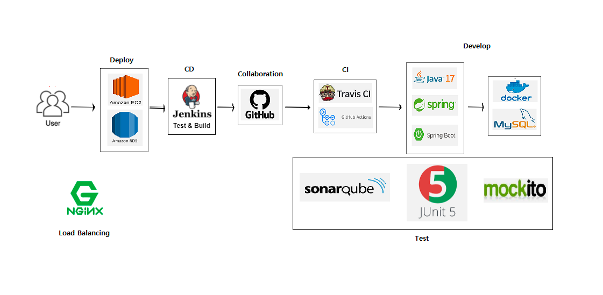

# gaboja
###Shopping Mall Rest API

---

gaboja는 상품 조회, 주문, 결제 등 쇼핑몰 기능을 제공하는 서비스입니다.

### 프로젝트 구조

---

### 기술스택

---

Java 17, Gradle, Spring Boot 2.7.1, Spring Data JPA, Spring Security, MySQL, AWS, OAuth 2.0, Github Action

### 프로젝트 기간

---

1차: 2022.07 ~ 2022.10

2차: 2022.12 ~

### 진행 상황

---

- 상품 (Product)
  - [ ] 등록
  - [ ] 수정
  - [ ] 삭제
    - [ ] cart 연관관계 설정
      - product 삭제 시 cart에 있는 해당 상품 삭제
  - [ ] 조회
    - [ ] 전체 조회
    - [ ] 상세 조회
      - [ ] 키워드 검색

- 주문 (Order)
  - [ ] 조회
  - [ ] 상태 변경
    - [ ] 주문 상태 변경 알림

- 장바구니 (Cart)
  - [ ] 생성
  - [ ] 삭제
  - [ ] 수정
  - [ ] 조회

- 결제 (Payment)
  - [ ] 카카오페이 결제 API
    - [ ] 주문 목록 결제 진행 
    - [ ] 결제 대기 / 승인

- 사용자 (User)
  - [ ] 네이버 소셜 로그인 진행
    - [ ] gaboja 서비스 JWT 토큰 발급
    - [ ] 인증/인가 권한 부여
  - [ ] 로그아웃
  - [ ] 사용자 정보 수정 
  
    
- CQRS
  - [ ] 조회 전용 모델 분리 (Order, Product)

- 배포 (Deployment)
  - [ ] AWS EC2 서버 이용
  - [ ] Travis CI
  - [ ] Jenkins CD

- 배송 (Delivery)

- 후기 (Review)

- QnA